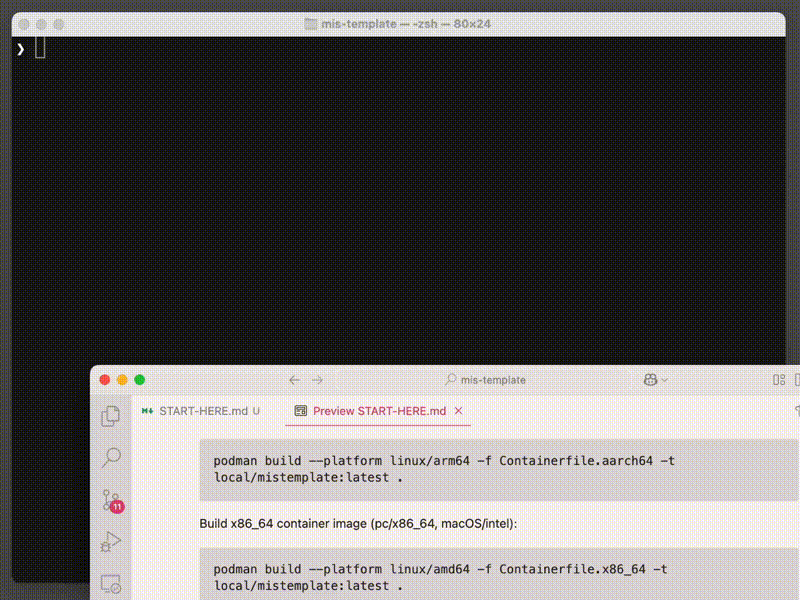

# Start here guide

Get Podman Desktop: https://podman-desktop.io

Get VSCode: https://code.visualstudio.com

Start working with containers can be a bit overwhelming at first. Let's go through some easy steps to get you started!

| Step | Content |
|---------|---------|
| [1. Create your repository from this template](#create-your-repository-from-this-template) | Steps to create a new repository from this template |
| [2. Rename project name in Visual Studio Code](#rename-project-name-in-visual-studio-code) | Instructions for renaming the project in VSCode |
| [3. Cleanup template directories and files](#cleanup-template-directories-and-files) | Guide to removing unnecessary files and directories |
| [4. Modify the handbook (README.md)](#modify-the-handbook-readme-md) | Information on modifying the README file |
| [5. Build container](#build-container) | Steps for building the container image |
| [6. Start container](#start-container) | Instructions for starting the container |
| [7. Open VSCode session in the container](#open-vscode-session-in-the-container) | Guide to opening VSCode inside the container |
| [8. Close VSCode container session](#close-vscode-container-session) | Steps to close the VSCode container session |

## Create your repository from this template

> 📦 First, create a repository from this template (**don't Fork** the project):


> 📦 Next, set a **name** and **description** for the repository and set your repository to **Private**.


## Rename project name in Visual Studio Code

> 📦 Search for: ```mistemplate```

> 📦 Replace **all** occurences with: ```yourprojectname``` (insert **your project name** here)

> 🚫 Don't use any **special characters or spaces** in the new project name!


## Cleanup template directories and files

> 📎 It is safe to remove all of these directories/files:

- assets/
- START-HERE.md


## Modify the handbook

The handbook (README.md) is mandatory for every project repository. Please modify it according to your needs.

## Build container

Building the container **is required only** if you start working on a new project or if you want to update your existing one. Here are the steps to build the container - choose the correct architecture for your machine:

> 📦 Build aarch64 container image (macOS/m1-m4, arm64):
```
podman build --platform linux/arm64 -f Containerfile.aarch64 -t local/mistemplate:latest .
```

> 📦 Build x86_64 container image (pc/x86_64, macOS/intel):
```
podman build --platform linux/amd64 -f Containerfile.x86_64 -t local/mistemplate:latest .
```

## Start container

> 📦 You'll need to run the container to start using it.

```
podman run --replace --log-level=info -d --interactive --name vcsmistemplate \
  -u root:root \
  -e HOME=/home/vscode \
  -v "$(pwd)/notebooks:/notebooks" \
  -v "$(pwd):/workspaces/vscode" \
  -v "$(pwd)/vscode-container-ext/.vscode-server:/home/vscode/.vscode-server" \
  local/mistemplate:latest \
  /bin/sh -c "while sleep 1000; do :; done"
```




## Open VSCode session in the container

Once the container is running, you can open a VSCode session inside it. Remember to replace `vcsmistemplate` with your actual container name.


## Close VSCode container session

If you want to **work with git**, you'll need leave the VSCode session. Since the container is a separate environment, you won't have your git environment available.


You should stop the container if do don't need it. If you don't know the name of your container, you **can get the name** by running the following command:

```
podman container ps
```

Use the following command to **stop the container**:

```
podman stop yourcontainernamehere
```

> 📎 You can also use the Podman Desktop app to manage your containers.